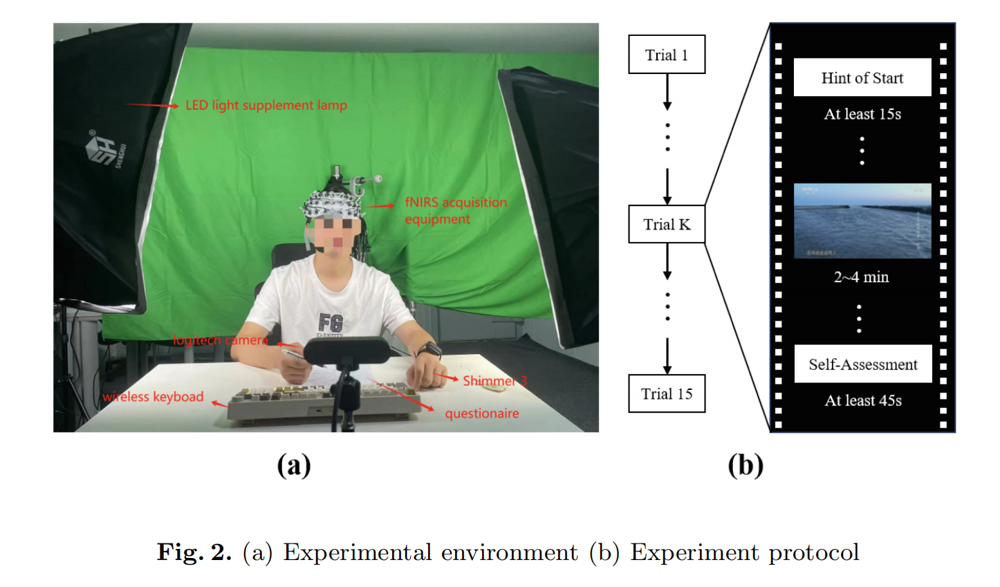

# REFN: A Multimodal Database for Emotion Analysis Using fNIRS

[](https://link.springer.com/chapter/10.1007/978-981-96-5084-2_2)
[](https://scut-acig.github.io/REFN/)
[]()

## 📖 Overview

REFN (Recognizing Emotions with Functional Near-infrared spectroscopy) is a comprehensive multimodal affective dataset designed for emotion analysis research using functional Near-Infrared Spectroscopy (fNIRS). This dataset addresses the critical shortage of publicly available fNIRS emotion datasets and provides a valuable resource for advancing emotion recognition research.

**Publication**: *CSIG Conference on Emotional Intelligence 2024*  
**Authors**: Dengjun Sun, Chunmei Qing*, Zhili Lai, Wanxiang Luo, Xiangmin Xu  
**Affiliation**: South China University of Technology

## 🎯 Key Features

- **28 participants** (14 males, 14 females, ages 19-27)
- **5 discrete emotions**: Pride, Happy, Neutral, Fear, Sad
- **3 recording sessions** per participant (one week apart)
- **Multimodal data**:
  - 48-channel fNIRS signals (11 Hz sampling rate)
  - Galvanic Skin Response (GSR) data
  - Photoplethysmographic (PPG) data
  - Facial expression videos (60 fps)

## 📊 Dataset Composition

### Experimental Design

- **Stimuli**: Carefully selected movie clips (2-4 minutes each)
- **Validation**: Pre-screened by 30 participants with arousal scores ≥5/10
- **Protocol**: 15 trials per session (3 trials per emotion)
- **Environment**: Soundproof room with controlled lighting

#### Overall Experimental Setup and Video Stimuli

<div align="center">
  
  <p><b>Figure 1.</b> (a) Overall experimental setup diagram showing the participant wearing fNIRS equipment in a soundproof room with LED light supplement lamp, fNIRS acquisition equipment, shimmer device, and wireless keyboard. (b) Video stimuli with different emotions - examples of video clips used to elicit Sad, Fear, Happy, Pride, and Neutral emotions.</p>
</div>

#### Experimental Environment and Protocol

<div align="center">
  
  <p><b>Figure 2.</b> (a) Experimental environment showing the complete setup with participant, equipment placement, and questionnaire interface. (b) Experiment protocol illustrating the trial structure: Hint of Start (at least 15s content summary) → Video playback (2-4 min) → Self-Assessment and rest period (at least 45s). This sequence repeats for all 15 trials (Trial 1 to Trial 15).</p>
</div>

### Data Collection

- **fNIRS System**: 48-channel NirScan (HuiChuang, China)
  - Wavelengths: 730 nm and 850 nm
  - Coverage: Frontal and temporal cortical regions
  - 10/20 international system positioning

#### fNIRS Probe Arrangement

<div align="center">
  
  <p><b>Figure 3.</b> (a) A schematic depiction of the fNIRS probe arrangement, where the red and blue circles signify the source and detector, respectively. A total of 31 probes (15 sources and 16 detectors) are positioned with 30mm spacing, centered at FPz position. (b) The topographical representation of the 48 fNIRS recording channels displayed on the standard human cortical surface, covering the frontal and temporal cortical regions.</p>
</div>

- **Physiological Sensors**: Shimmer3 wearable device
  - GSR and PPG data collection

- **Video Recording**: Logitech C1000e camera
  - Frontal facial expressions at 60 fps

## 🔬 Research Highlights

### Hemodynamic Response Analysis

Our study reveals distinct oxyhemoglobin (HbO) activation patterns across different emotional states:

- **Pride**: Strong HbO activation, peaking around 10 seconds
- **Happy**: High initial activation with sustained increase
- **Neutral**: Stable, moderate HbO levels
- **Fear**: Lower activation compared to neutral
- **Sad**: Negative HbO activation, contrasting with positive emotions

### Classification Performance

We established baseline performance using both machine learning and deep learning models:

#### Subject-Specific Classification
- **5-class**: Up to 32.4% accuracy (CNN)
- **2-class (Positive/Negative)**: Up to 64.2% accuracy (Transformer)

#### Cross-Participant Classification
- **5-class**: Up to 28.1% accuracy (LSTM)
- **2-class (Positive/Negative)**: Up to 57.8% accuracy (Transformer)

#### Pairwise Binary Classification (Best Results)
- **Subject-specific**: Up to 71.5% accuracy (Fear vs. Pride)
- **Cross-participant**: Up to 62.9% accuracy (Fear vs. Pride)


## 🛠️ Preprocessing Pipeline

1. **Motion Artifact Correction**: Spline interpolation method
   - AMP_Threshold: 0.5
   - STD_Threshold: 6

2. **Band-pass Filtering**: 0.01-0.2 Hz
   - Removes heartbeat, respiration, and Mayer wave noise

3. **Concentration Conversion**: Modified Beer-Lambert Law
   - Converts optical density to HbO/HbR concentrations
   - DPF (Differential Path Length Factor): 6

4. **Baseline Correction**: 10-second pre-stimulus window

## 🚀 Models Implemented

### Machine Learning
- k-Nearest Neighbors (KNN)
- Support Vector Machine (SVM)
- Random Forest (RF)
- Linear Discriminant Analysis (LDA)

### Deep Learning
- Convolutional Neural Network (CNN)
- Long Short-Term Memory (LSTM)
- Transformer

## 📥 Access

**To download the paper PDF:**

📄 **Paper Download**: [https://link.springer.com/chapter/10.1007/978-981-96-5084-2_2](https://link.springer.com/chapter/10.1007/978-981-96-5084-2_2)

**To obtain the REFN dataset, please visit our official dataset website:**

🌐 **Dataset Application**: [https://scut-acig.github.io/REFN/](https://scut-acig.github.io/REFN/)

**Important Notes:**
- All dataset requests must be submitted through the official website
- Academic use only - please review the terms of use carefully
- After approval, you will receive download instructions
- The dataset includes raw data, preprocessed data, and all source code for reproduction

## 📝 Citation

If you use the REFN dataset in your research, please cite:

```bibtex
@inproceedings{sun2024refn,
  title={REFN: A Multimodal Database for Emotion Analysis Using Functional Near-Infrared Spectroscopy},
  author={Sun, Dengjun and Qing, Chunmei and Lai, Zhili and Luo, Wanxiang and Xu, Xiangmin},
  booktitle={CSIG Conference on Emotional Intelligence},
  pages={20--37},
  year={2024},
  publisher={Springer},
  doi={10.1007/978-981-96-5084-2_2}
}
```

## 🔍 Key Findings

1. **Functional Connectivity**: Significant differences observed across five emotions in prefrontal and temporal regions

2. **Individual Variability**: Notable performance differences between participants, highlighting the importance of addressing individual differences

3. **Challenge**: Cross-participant emotion recognition remains challenging, with significant room for improvement in handling inter-participant variability

## 🎓 Applications

- Emotion recognition system development
- Brain-Computer Interface (BCI) research
- Affective computing studies
- Human-Computer Interaction (HCI)
- Mental health monitoring
- Neuromarketing research

## 🤝 Contributing

We welcome contributions to improve classification methods and explore multimodal fusion strategies. Please feel free to:

- Report issues
- Submit pull requests
- Share your research findings using this dataset

## 📧 Contact

For questions or collaboration inquiries:

- **Email**: qchm@scut.edu.cn
- **Lab Website**: [SCUT-ACIG](https://github.com/SCUT-ACIG)

## 📜 License

This dataset is made available for academic research purposes. Please refer to the dataset website for detailed terms of use.

## 🙏 Acknowledgements

This work is supported by:
- National Natural Science Foundation of China (61972163)
- Natural Science Foundation of Guangdong Province (2022A1515011555, 2023A1515012568)
- Guangdong Provincial Key Laboratory of Human Digital Twin (2022B1212010004)

---

**Note**: Ethics approval was obtained from the ethics committee of The Third Affiliated Hospital of Sun Yat-sen University. All participants provided informed consent, and were made aware that the data would be publicly available.
